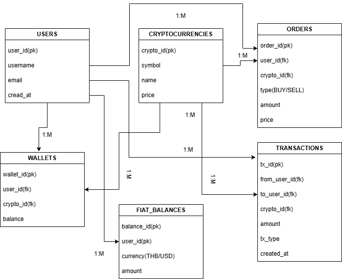

# Crypto Exchange API

ระบบ API สำหรับแลกเปลี่ยน Cryptocurrency พัฒนาด้วย Node.js, Express.js และ Sequelize ORM

## โจทย์การทดสอบ

### ข้อ 1: ออกแบบระบบฐานข้อมูล (ER Diagram)
ระบบตัวกลางการแลกเปลี่ยน Cryptocurrencies ที่สามารถ:
- นำเงิน Fiat (THB, USD) มาซื้อเหรียญจาก User อื่นในระบบ
- โอนเหรียญภายในระบบหรือภายนอกระบบ
- ตั้งซื้อ-ขาย Cryptocurrencies (BTC, ETH, XRP, DOGE)
- บันทึกการโอนเงินและซื้อ-ขายแลกเปลี่ยน
- สร้างบัญชีผู้ใช้

### ข้อ 2: เขียนโปรแกรมด้วย Node.js
- Method ใน Model เพื่อดึงข้อมูลที่มีความสัมพันธ์กัน
- Controller และ Routing ส่วนหลัก
- Seed ข้อมูลสำหรับทดสอบ

## แนวคิดการออกแบบ

## ER Diagram


### Database Schema
ออกแบบตาม Entity-Relationship โดยแยกข้อมูลออกเป็น 6 ตารางหลัก:

**Users** - ข้อมูลผู้ใช้งาน  
**Cryptocurrencies** - ข้อมูลเหรียญดิจิทัลและราคา  
**Wallets** - กระเป๋าเงินของผู้ใช้ (1 user = 1 wallet ต่อ 1 crypto)  
**Fiat_Balances** - ยอดเงินสดแยกตามสกุล (THB, USD)  
**Orders** - คำสั่งซื้อ/ขายพร้อมสถานะ  
**Transactions** - บันทึกการเคลื่อนไหวทุกรายการ  

### API Architecture
ใช้หลัก MVC Pattern แยกความรับผิดชอบ:
- **Models**: จัดการข้อมูลและ relationship methods
- **Controllers**: ประมวลผล business logic
- **Routes**: จัดการ API endpoints

### Technology Stack
- **Node.js + Express.js**: Backend framework
- **Sequelize ORM**: จัดการฐานข้อมูลและ relationships
- **SQLite**: ฐานข้อมูลสำหรับการทดสอบ

## การติดตั้งและใช้งาน

### ขั้นตอนการติดตั้ง

1. Clone repository
```bash
git clone https://github.com/supasukit/Test_Backend.git
cd Test_Backend
```

2. ติดตั้ง dependencies
```bash
npm install
```

3. ตั้งค่า environment
```bash
cp .env.example .env
```

4. สร้างข้อมูลตัวอย่าง
```bash
npm run seed
```

5. รันเซิร์ฟเวอร์
```bash
npm start
```

เซิร์ฟเวอร์จะทำงานที่ `http://localhost:3000`

## การใช้งานบน Windows PowerShell

### API Endpoints หลัก

**ข้อมูลระบบ:**
```powershell
# ข้อมูล API ทั้งหมด
Invoke-RestMethod -Uri "http://localhost:3000/api"

# สถานะเซิร์ฟเวอร์
Invoke-RestMethod -Uri "http://localhost:3000/health"
```

**จัดการผู้ใช้:**
```powershell
# ดูผู้ใช้ทั้งหมด
Invoke-RestMethod -Uri "http://localhost:3000/api/users"

# สร้างผู้ใช้ใหม่
$newUser = @{
    username = "trader_new"
    email = "trader@example.com"
    password = "password123"
} | ConvertTo-Json

Invoke-RestMethod -Uri "http://localhost:3000/api/users" -Method POST -Body $newUser -ContentType "application/json"
```

**ดูข้อมูลที่เกี่ยวข้องกับผู้ใช้:**
```powershell
# กระเป๋าเงิน
Invoke-RestMethod -Uri "http://localhost:3000/api/users/1/wallets"

# ยอดเงินสด
Invoke-RestMethod -Uri "http://localhost:3000/api/users/1/fiat-balances"

# คำสั่งซื้อขาย
Invoke-RestMethod -Uri "http://localhost:3000/api/users/1/orders"

# ประวัติธุรกรรม
Invoke-RestMethod -Uri "http://localhost:3000/api/users/1/transactions"
```

**ระบบซื้อ-ขาย Cryptocurrencies:**
```powershell
# ดูเหรียญทั้งหมด (BTC, ETH, XRP, DOGE)
Invoke-RestMethod -Uri "http://localhost:3000/api/cryptocurrencies"

# สร้างคำสั่งซื้อ BTC
$buyOrder = @{
    user_id = 1
    crypto_id = 1
    type = "BUY"
    amount = 0.1
    price = 45000
} | ConvertTo-Json

Invoke-RestMethod -Uri "http://localhost:3000/api/orders" -Method POST -Body $buyOrder -ContentType "application/json"

# สร้างคำสั่งขาย ETH
$sellOrder = @{
    user_id = 2
    crypto_id = 2
    type = "SELL"
    amount = 1.5
    price = 3200
} | ConvertTo-Json

Invoke-RestMethod -Uri "http://localhost:3000/api/orders" -Method POST -Body $sellOrder -ContentType "application/json"
```

**ระบบโอนเงินและธุรกรรม:**
```powershell
# โอนเงินระหว่างผู้ใช้
$transfer = @{
    from_user_id = 1
    to_user_id = 2
    crypto_id = 1
    amount = 0.05
    tx_type = "TRANSFER"
} | ConvertTo-Json

Invoke-RestMethod -Uri "http://localhost:3000/api/transactions" -Method POST -Body $transfer -ContentType "application/json"

# บันทึกการซื้อขายแลกเปลี่ยน
$trade = @{
    from_user_id = 2
    to_user_id = 3
    crypto_id = 2
    amount = 2.0
    tx_type = "TRADE"
} | ConvertTo-Json

Invoke-RestMethod -Uri "http://localhost:3000/api/transactions" -Method POST -Body $trade -ContentType "application/json"

# ดูธุรกรรมทั้งหมด
Invoke-RestMethod -Uri "http://localhost:3000/api/transactions"
```

## การทำงานของระบบ

### Model Relationships
ใช้ Sequelize ORM สร้าง methods พิเศษใน Models:

**User Model:**
- `getMyWallets()` - ดึงกระเป๋าเงินพร้อมข้อมูลเหรียญ
- `getMyOrders()` - ดึงคำสั่งซื้อขายพร้อม filter
- `getMyTransactions()` - ดึงธุรกรรมที่เป็นทั้งผู้ส่งและผู้รับ
- `getSummary()` - สรุปข้อมูลครบถ้วน

**Cryptocurrency Model:**
- `getWallets()` - ดึงกระเป๋าที่เก็บเหรียญนี้
- `getOrders()` - ดึงคำสั่งซื้อขายของเหรียญนี้

### API Response Format
```json
{
  "success": true,
  "count": 4,
  "data": [...]
}
```

### Transaction Types
- **TRANSFER** - โอนเงินระหว่างผู้ใช้
- **TRADE** - การซื้อขายแลกเปลี่ยน
- **DEPOSIT** - ฝากเงินเข้าระบบ
- **WITHDRAWAL** - ถอนเงินออกจากระบบ

## ข้อมูลตัวอย่าง

หลังรัน `npm run seed` จะได้:
- ผู้ใช้ 4 คน: john_trader, jane_crypto, bob_investor, alice_hodler
- เหรียญ 4 ตัว: BTC ($45,000), ETH ($3,200), XRP ($0.65), DOGE ($0.08)
- กระเป๋าเงิน 8 กระเป๋า
- ยอดเงินสด 7 บัญชี (THB, USD)
- คำสั่งซื้อขาย 5 คำสั่ง
- ธุรกรรม 5 รายการ

## โครงสร้างโปรเจค

```
crypto-exchange-api/
├── app.js              # ไฟล์หลักของแอพ
├── package.json        # dependencies
├── .env.example        # ตัวอย่างการตั้งค่า
├── config/
│   └── database.js     # การตั้งค่าฐานข้อมูล
├── models/             # โมเดลและ relationships
│   ├── index.js
│   ├── User.js
│   ├── Cryptocurrency.js
│   ├── Wallet.js
│   ├── FiatBalance.js
│   ├── Order.js
│   └── Transaction.js
├── controllers/        # business logic
│   ├── UserController.js
│   ├── OrderController.js
│   └── TransactionController.js
├── routes/
│   └── api.js         # API endpoints
└── seeders/
    └── seed.js        # ข้อมูลตัวอย่าง
```

## คำสั่งที่ใช้

```bash
npm start          # เริ่มเซิร์ฟเวอร์
npm run dev        # โหมด development
npm run seed       # สร้างข้อมูลตัวอย่าง
```

## Security Considerations

### ปัจจุบัน (สำหรับการทดสอบ)
- ใช้ SQLite เพื่อความง่ายในการติดตั้ง
- Password เก็บเป็น plain text
- ไม่มี authentication middleware
- CORS เปิดให้ทุก origin

### การปรับปรุงสำหรับ Production
- **Authentication**: JWT tokens สำหรับ user sessions
- **Password Security**: bcrypt hashing พร้อม salt
- **Database**: เปลี่ยนเป็น PostgreSQL หรือ MySQL
- **Rate Limiting**: จำกัดจำนวน API calls ต่อ IP
- **Input Validation**: validation และ sanitization ที่เข้มงวด
- **HTTPS**: SSL/TLS encryption สำหรับการสื่อสาร
- **Environment Variables**: แยกค่า sensitive ออกจากโค้ด